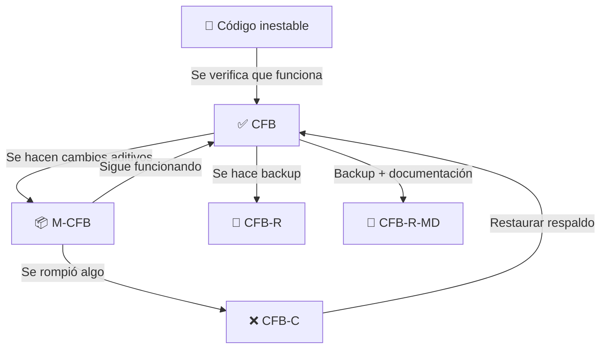

# CFB — Metodología de Desarrollo Seguro para Proyectos con IA

**Fecha de creación:** 2026-07-20
**Versión:** 1.0
**Estado:** ✅ Estable

---

## Índice

1. [Definición](#definición)
2. [Conceptos Clave](#conceptos-clave)
3. [Estados del CFB](#estados-del-cfb)
4. [Ciclo de Vida](#ciclo-de-vida)
5. [Mapa de CFB del Proyecto](#mapa-de-cfb-del-proyecto)
6. [Procedimientos](#procedimientos)
7. [Registro de CFB-R / CFB-R-MD](#registro-de-respaldos)
8. [Glosario](#glosario)

---

## Definición

**CFB** = **Código Funcionando Bien**.

Es una metodología de trabajo para proyectos donde intervienen **IA generativas (LLMs)**. Su propósito es proteger el código funcional frente a regresiones accidentales, un problema común cuando una IA introduce cambios que rompen algo que ya funcionaba.

El CFB no es una herramienta ni un script: es un **patrón de disciplina** que establece puntos de control, respaldos y documentación mínima para garantizar que siempre se pueda volver a un estado conocido y funcional.

### ¿Por qué es necesaria?

Las IA no tienen memoria perfecta entre sesiones. Es frecuente que:

- Una IA **olvide** una funcionalidad previa al reescribir un archivo
- Un cambio aparentemente inocuo **rompa** una interacción existente
- La IA **sobre-escriba** lógica que no debía tocarse

CFB mitiga esto con **registro, respaldo y trazabilidad**.

---

## Conceptos Clave

### CFB — Código Funcionando Bien

Es el **estado actual y funcional** de un archivo o módulo. No es un backup ni un commit, sino la **certificación** de que ese código funciona y es visualmente correcto.

### M-CFB — Mejora sobre CFB

Es un cambio **exclusivamente aditivo** sobre un CFB existente:

| Regla | Descripción |
|-------|-------------|
| ❌ | No modificar funciones existentes del CFB |
| ✅ | Solo agregar nuevas funciones, utilidades o mejoras |
| 🔄 | Si una mejora rompe algo, se revierte al CFB y se rehace |
| 📝 | Cada M-CFB se documenta en el MD del CFB correspondiente |

### CFB-R — Respaldo Automático

**Código funciona bien → se hace un respaldo.**

Acción: Copiar el archivo a la carpeta `MD2/` con la nomenclatura estándar.

No incluye documentación, solo el archivo de respaldo.

### CFB-R-MD — Respaldo con Documentación

**Código funciona bien → se hace un respaldo + se crea/actualiza el MD.**

Acción: Copiar el archivo + escribir o actualizar el markdown de ese CFB documentando qué incluye, su estado y los M-CFB aplicados.

### CFB-C — Código Corrompido

**Código funcionaba bien pero se corrompió → se vuelve atrás.**

Acción: Restaurar desde el respaldo CFB-R o CFB-R-MD más reciente, y documentar la causa de la corrupción para no repetirla.

---

## Estados del CFB



| Estado | Símbolo | Significado | Acción |
|--------|---------|-------------|--------|
| ✅ CFB | `✅` | Funciona correctamente | Navegar seguro |
| 📦 M-CFB | `📦` | Mejora aplicada sobre CFB | Documentar en MD |
| 💾 CFB-R | `💾` | Respaldo realizado | Guardar archivo |
| 📄 CFB-R-MD | `📄` | Respaldo + documentación | Guardar archivo + escribir MD |
| ❌ CFB-C | `❌` | Corrompido, hay que revertir | Restaurar respaldo + investigar causa |

---

## Ciclo de Vida

```
1. [Verificar]  → ¿El código funciona? → Sí → es CFB
                                           ↓ No
2. [Restaurar]  → Volver al último CFB-R o CFB-R-MD
                → Documentar por qué falló (CFB-C)
3. [Modificar]  → Hacer cambios (M-CFB)
                → Verificar que no se rompió nada
4. [Respaldar]  → CFB-R o CFB-R-MD según corresponda
5. [Volver a 1] → Mantener el ciclo
```

**Importante:** Siempre que se cierra una sesión con IA, debe quedar un **CFB-R-MD** del archivo o módulo que se trabajó. Así la siguiente sesión parte de un punto conocido.

---

## Mapa de CFB del Proyecto

### CFB-EDITOR — Editor de Formularios Visual

| Campo | Valor |
|-------|-------|
| **Archivo** | `public/EditForm2.html` |
| **Tamaño** | ~780 líneas |
| **Documento** | `CFB_BASELINE.md` |
| **Respaldo más reciente** | `MD2/EDITOR_FINAL_20260720_080032.html` |
| **Estado** | ✅ CFB |
| **M-CFB aplicados** | 6 (navegación interna, línea, checkbox, vista previa, etc.) |

### CFB-PREVIA — Vista Previa de Formularios

| Campo | Valor |
|-------|-------|
| **Archivo** | `public/previaform.html` |
| **Documento** | Documentado dentro de `CFB_BASELINE.md` (M-CFB #5) |
| **Estado** | ✅ CFB |

### CFB-FORM-ACC — Formulario de Accidente Escolar

| Campo | Valor |
|-------|-------|
| **Archivo** | `public/formulario.html` |
| **Componente React** | `src/pages/FormularioAccidenteGenerado.tsx` |
| **Documento** | — |
| **Estado** | ✅ CFB |
| **Notas** | HTML generado desde el editor. Se carga via fetch y se inyecta con React. |

### CFB-REG-ACC — Registro de Accidentes

| Campo | Valor |
|-------|-------|
| **Archivo** | `src/pages/RegistrarAccidente.tsx` |
| **Servicio** | `src/services/accidentes.service.ts` |
| **Migración** | `supabase/migrations/031_create_accidentes_escolares.sql` |
| **Documento** | — |
| **Estado** | ✅ CFB |

### CFB-PERMISOS — Asignación de Permisos

| Campo | Valor |
|-------|-------|
| **Archivo** | `src/pages/AsignarPermisos.tsx` |
| **Documento** | — |
| **Estado** | 🔄 En desarrollo |

---

## Procedimientos

### P1: Marcar un archivo como CFB

```bash
# 1. Verificar que funciona (tests visuales o unitarios)
# 2. Ejecutar respaldo:
cp public/mi-archivo.html MD2/mi-archivo_$(date +%Y%m%d_%H%M%S).html
# 3. (Opcional) Crear o actualizar el MD con su estado
```

### P2: Aplicar M-CFB

1. Identificar el CFB base
2. Hacer cambios **aditivos** — no modificar lógica existente
3. Verificar que el CFB sigue funcionando
4. Documentar el cambio en el MD correspondiente:

```markdown
### M-CFB #N — Título del cambio

**Cambio:** Descripción breve.
**Archivos afectados:** lista de rutas.
**Motivo:** Por qué se hizo.
```

### P3: Recuperar de CFB-C (corrupción)

1. Identificar qué archivo se corrompió
2. Buscar el respaldo más reciente en `MD2/`
3. Restaurar:
   ```bash
   cp MD2/mi-archivo_20260719_120000.html public/mi-archivo.html
   ```
4. Documentar en el MD:
   ```markdown
   ### ⚠️ CFB-C recuperado — Fecha
   
   **Archivo:** ruta
   **Causa:** qué ocurrió
   **Respaldo usado:** ruta del respaldo
   **Lección:** cómo evitarlo en el futuro
   ```
5. Rehacer los cambios con más cuidado

### P4: Cierre de sesión con IA

Al terminar una sesión de trabajo con IA:

1. ✅ Verificar que los archivos modificados funcionan
2. 💾 Ejecutar CFB-R (respaldo) de cada archivo tocado
3. 📄 Si el archivo es crítico, ejecutar CFB-R-MD (respaldo + documentación)
4. 📝 Anotar en el MD el último respaldo y los cambios realizados

---

## Nomenclatura de Archivos

### Respaldos (CFB-R)

```
MD2/<NOMBRE>_<AAAAMMDD>_<HHMMSS>.html
MD2/<NOMBRE>_<AAAAMMDD>_<HHMMSS>.tsx
```

Ejemplos:
- `EDITOR_BACKUP_20260719_192056.html`
- `EDITOR_FINAL_20260720_080032.html`
- `PREVIAFORM_20260719_220442.html`

### Documentos (CFB-R-MD)

```
MD2/CFB_<NOMBRE>.md
MD2/AVANCES_<NOMBRE>.md
```

Ejemplos:
- `CFB_BASELINE.md`
- `AVANCES_EDITOR.md`
- `AVANCE_GENERAL.md`

---

## Registro de Respaldos

### CFB-R (solo respaldo)

| Archivo | Respaldo | Fecha |
|---------|----------|-------|
| `public/EditForm2.html` | `EDITOR_BACKUP_20260717_032107.html` | 2026-07-17 |
| `public/EditForm2.html` | `EDITOR_BACKUP_20260717_235239.html` | 2026-07-17 |
| `public/EditForm2.html` | `EDITOR_BACKUP_20260719_183025.html` | 2026-07-19 |
| `public/EditForm2.html` | `EDITOR_BACKUP_20260719_184545.html` | 2026-07-19 |
| `public/EditForm2.html` | `EDITOR_BACKUP_20260719_192056.html` | 2026-07-19 |
| `public/EditForm2.html` | `EDITOR_BACKUP_20260719_202838.html` | 2026-07-19 |
| `public/EditForm2.html` | `EDITOR_FINAL_20260719_213226.html` | 2026-07-19 |
| `public/EditForm2.html` | `EDITOR_FINAL_20260719_220442.html` | 2026-07-19 |
| `public/EditForm2.html` | `EDITOR_FINAL_20260720_080032.html` | 2026-07-20 |
| `public/previaform.html` | `PREVIAFORM_20260719_220442.html` | 2026-07-19 |
| `public/previaform.html` | `EDITOR_FINAL_20260720_080032.html` | 2026-07-20 |

### CFB-R-MD (respaldo + documentación)

| Archivo | Documento | Fecha |
|---------|-----------|-------|
| `public/EditForm2.html` | `MD2/CFB_BASELINE.md` | 2026-07-19 |
| `public/EditForm2.html` | `MD2/AVANCES_EDITOR.md` | 2026-07-19 |
| `public/EditForm2.html` | `MD2/AVANCES_FINAL.md` | 2026-07-19 |
| Todo el proyecto | `MD2/AVANCE_GENERAL.md` | 2026-07-19 |

---

## Glosario

| Término | Significado |
|---------|-------------|
| **CFB** | Código Funcionando Bien. Estado actual verificado como funcional. |
| **M-CFB** | Mejora aditiva sobre un CFB. No altera lo existente. |
| **CFB-R** | Respaldo del archivo (copia). |
| **CFB-R-MD** | Respaldo + documentación en markdown. |
| **CFB-C** | Código Corrompido. Estado roto que requiere restauración. |
| **IA** | Modelo de lenguaje (LLM) que genera o modifica código. |
| **Regresión** | Pérdida accidental de funcionalidad preexistente. |
| **Baseline** | Línea base, punto de referencia estable. |

---

## Historial de revisiones

| Fecha | Versión | Cambio | Autor |
|------|---------|--------|-------|
| 2026-07-20 | 1.0 | Creación del documento | Claude + Moisgood |
